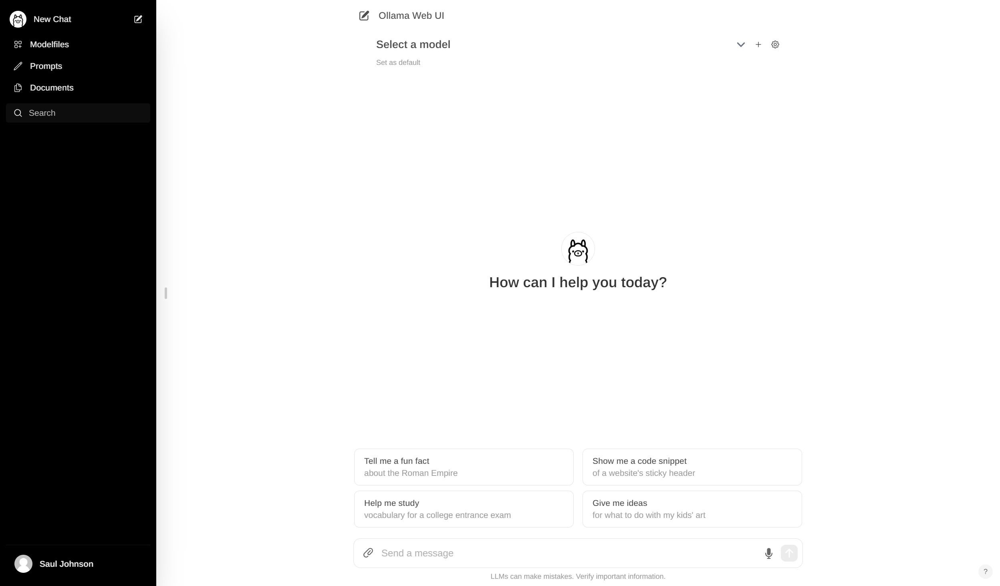
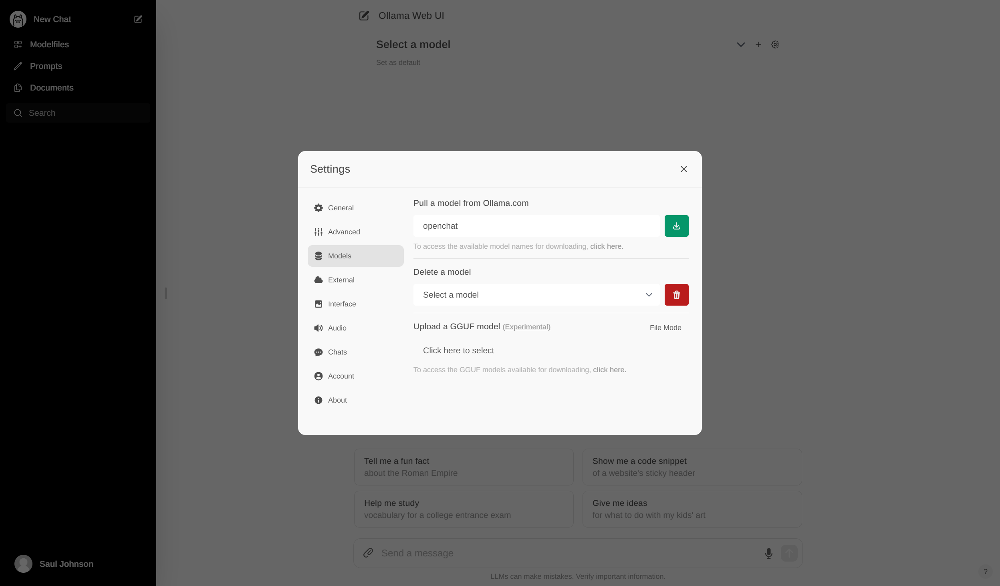

# limbosh
The honeypot shell that traps you in a conversation with an LLM pretending to be a shell.


## Overview
Limbosh is named after the concept of [_Limbo_](https://en.wikipedia.org/wiki/Limbo), a liminal space where souls are held for eternity. In limbosh, likewise, the LLM will string attackers along for eternity (if it can!) in a fake shell, sandboxing them from interacting with the real system.



## Prerequisites
To run limbosh out of the box, you'll need a few things set up on your machine first:

* Python 3.10 or higher with `pip`
* An OpenAI API key (get one [here](https://platform.openai.org))

## Setup
First, ensure that you've taken care of the prerequisites above. Then, from the root of the repository, set up a Python virtual environment:

```bash
python3 -m venv venv
```

Then, enter the virtual environment. On Windows, execute the following command in PowerShell:

```powershell
./venv/bin/Activate.ps1
```

From bash on Mac or Linux, run:

```bash
. venv/bin/activate
```

From here, upgrade `pip` and install dependencies:

```bash
pip install --upgrade pip
pip install -r requirements.txt
```

### Configuring OpenAI Connectivity
The most performant way to run Limbosh is by outsourcing running the LLM to the OpenAI API.

If you want to do this, you'll need to start by signing in to your [OpenAI platform account](https://platform.openai.com`), charging your account with credits, and creating an API key.

First, copy the `config.json.example` file to `config.json`. Do not commit thie new file to source control (it's in `.gitignore` because it will contain your secret API key).

```bash
cp config.json.example config.json
```

Now, open up `config.json` in your favourite text editor and paste your API key in place of `<your_api_key_here>`. Set the `model` field to either:

* `gpt-3.5-turbo` for GPT 3.5 (faster and cheaper, not as convincing)
* `gpt-4` for GPT 4.0 (slower and more expensive but with very convincing output)

You're now ready to run the program! Either call the script with Python directly (make sure you're in your virtual environment):

```bash
python3 limbosh.py
```

Or alternatively (on Mac or Linux), use the shortcut:

```bash
# chmod u+x limbosh
./limbosh
```

### Running Against a Local LLM using Ollama
Limbosh also supports running against local LLMs using [Ollama](https://ollama.com/). To do this, you'll first need to install Ollama and pull your preferred LLM. You can do this like so for `openchat` for example:

```bash
ollama pull openchat
```

This will start the Ollama daemon process automatically, with its API listening on `localhost:11434`. Now, set up your `config.json` file like so. Note that `openai_api_key` is not needed for local LLM deployments on Ollama.

```json
{
    "model_name": "openchat",
    "openai_api_key": "not-needed-for-local-llms",
    "system_prompt": "system_prompts/high_value_maritime_system.txt",
    "ollama": {
        "hostname": "localhost",
        "port": 11434
    }
}
```

Ollama has [an extensive model library](https://ollama.com/library) that you can install and try out with one `ollama pull` command.

### Configuring System Prompts
You can find the system prompts that seed the LLM context in `/system_prompts`. The only system prompt included currently instructs the LLM to act as a bash shell on a high-value maritime system.

If you wish to create additional system prompts, simply create a new text file in `/system_prompts` and change the `system_prompt` key in `config.json` to point to this instead.

## Deployment
You may wish to run a containerized version of limbosh in order to test it out or deploy it practically as a honeypot (don't do this yet, see vulnerabilities section below). To do so, **first make sure you've configured OpenAI connectivity (see above)** then build the container like so:

```bash
docker build . -t limbosh
```

Now run it, you'll be dropped into limbosh automatically. Note that forwarding port `11434` is only necessary if you're running an LLM locally on Ollama:

```bash
docker run --rm -d -p 2222:22 -p 11434:11434 limbosh
```

By default, a honeypot user `admin` (password also `admin`) will be created. SSH into it like so:

```bash
ssh -p 2222 admin@127.0.0.1
```

As soon as you connect and authenticate, you'll be dropped into a limbosh shell.

### Using Docker Compose
If you'd like a complete setup out of the box, you can use Docker Compose. This involves a few more steps but keeps complexity to a minimum.

First, configure your `config.json` and get the Limbosh Docker Compose environment running (make sure to pass `--build` to carry across any config changes you've made):

```bash
docker compose up --build
```

This will bring up 3 containers:

* `limbosh-honeypot`: The Limbosh honeypot shell container. Port 22 is forwarded to port 2222 on the local machine, with honeypot username/password `admin:admin`.
* `ollama`: The Ollama container. Note that GPU acceleration is not set up (and is not even supported on Windows) so this will be _extremely slow_.
* `ollama-webui`: The Ollama web UI. You'll need to use this to install a model to query.

Once everything is up and running, browse to `http://localhost:3000` in your browser. After creating an account (it's 100% local), you'll find yourself in the Ollama web UI, which looks a bit like the ChatGPT UI.



Click on your profile in the bottom left and browse to `Settings > Models`. From here, install whichever model you configured via your `config.json` file (`openchat` in this example):



This can take a while, so be patient. Once it's done, you can run the usual command to SSH into the honeypot:

```bash
ssh -p 2222 admin@127.0.0.1
```

Remember, on Windows, GPU acceleration is not available for Ollama on Docker. This means the CPU has to handle the full load of running the LLM, and this is very slow. You might have to wait a minute or more between entering a command and receiving something back!

## Acknowledgements
The limbosh proof-of-concept was created by Saul Johnson ([@lambdacasserole](https://github.com/lambdacasserole)). Feel free to direct any questions, ideas, comments or contributions his way.
